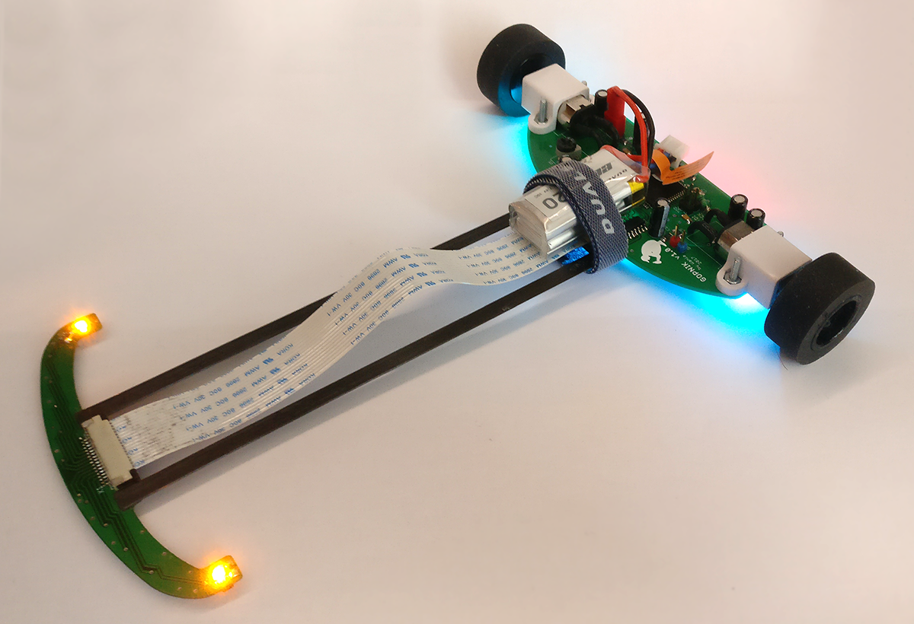
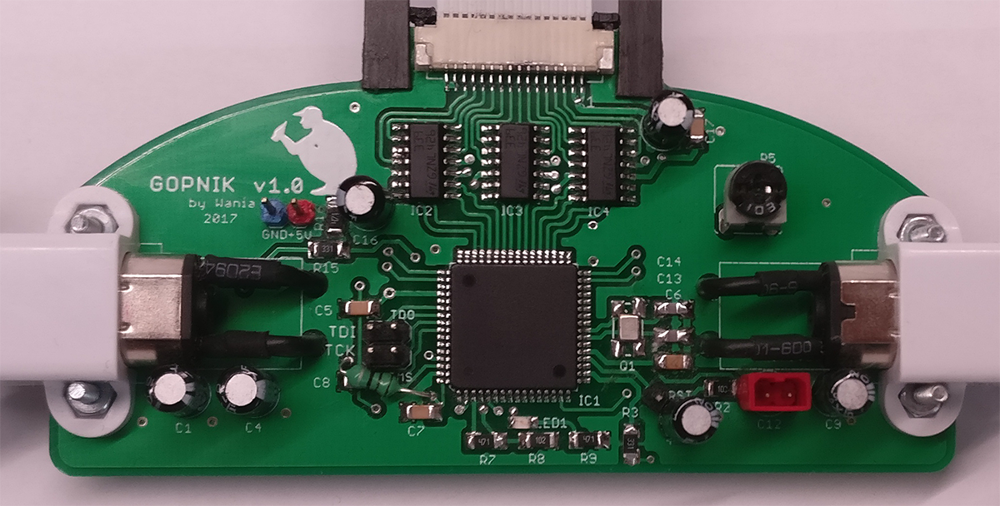
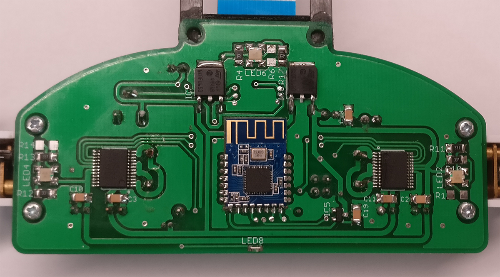
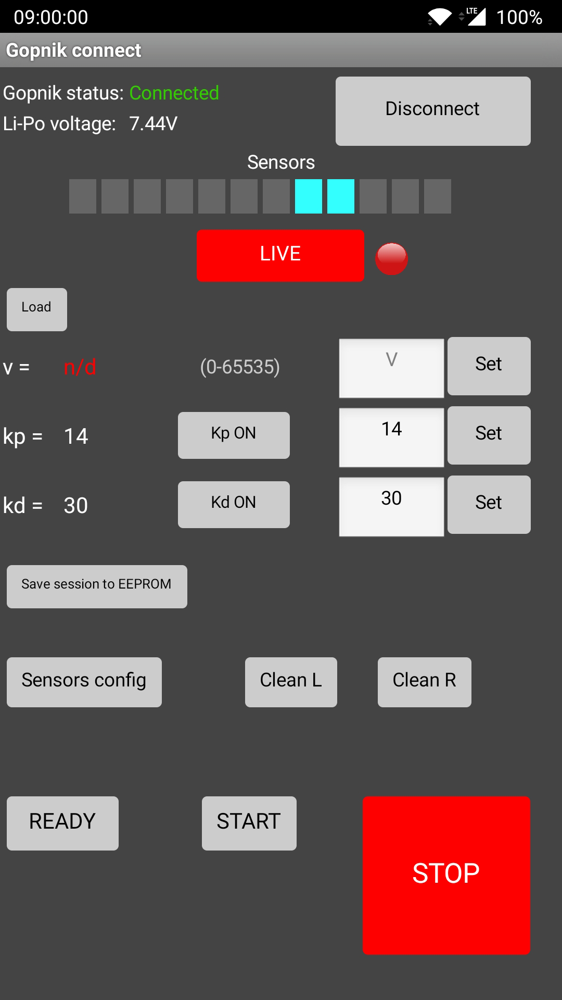

# Line Follower Gopnik - robot śledzący linię

## Cechy:
* autonomiczne podążanie trasą wyznaczoną przez linię
* podgląd stanu czujników w czasie rzeczywistym
* zmiana wag czujników oraz nastaw regulatora PID z poziomu aplikacji mobilnej
* przechowywanie ustawień w pamięci EEPROM
* samoczynne zatrzymanie w przypadku opuszczenia trasy
* funkcja czyszczenia kół
* pomiar napięcia akumulatora
* obniżona masa listwy z czujnikami dzięki zastosowaniu laminatu o grubości 0.8mm
* wydajne silniki Pololu 999 z przekładnią 10:1
* lekki akumulator Li-Pol 7.4V 220mAh
---

